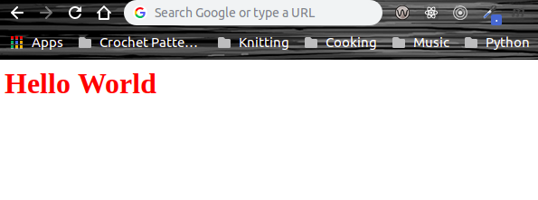

# CSS Fundamentals

## 1. Set CSS Properties and Values (syntax)

**CSS (Cascading StyleSheets)** is a _styling_ language that controls how documents are presented on the Web to users. This means it controls how text, images, and other elements are displayed.

This is an example of the **syntax  (instructions that you write that are interpreted by the browser to give you your expected results)** used by `CSS`:

 ```css
  h1 {
    color: red;
  }
```

This is the result of the syntax above:



In order to get the result that is displayed above, first you're going to want to to create an **HTML (HyperText Markup Language)** document. You can think of HTML as the the skeleton (structure) of your Web Page. 

```HTML
<!Doctype html>
<html>
  <head>
  </head>
  <body>
  </body>
</html>
```

To get a better understanding of how to create an HTML document and the HTML syntax above checkout [w3schools's](https://www.w3schools.com/html/html_intro.asp) awesome hands-on introduction.

Next you want to create an **external stylesheet**. What this means is that you're pretty much going to have a separte file with a `.css` extension that will hold all of your styles for your site. What you chose to name the file is completely up to you, but a nice is convention is `styles.css`. 

Once you have created both your HTML document and external stylesheet, you want to open up your HTML document and include a `<link>` tag between your `head` tag: 

```HTML
  <head>
    <link rel="stylesheet" type="text/css" href="styles.css">
  </head>
```

What this syntax does is it creates a link between your HTML document and your external stylesheet. So any styling applied to the external stylesheet will affect the elements of the HTML document that it is linked to. 

Now, while you still have your HTML document open go ahead and add an `h1` tag with the text `Hello World` between the `body` tag:

```HTML
<body>
  <h1>Hello World</h1>
</body>
```

Now open your HTML document by right clicking it and selecting your browswer:


<br/>

Now you should see something like this in your browser:


If for some reason you're not getting the same results, check the syntax of your HTML and make sure everything is written exactly as it is above.

Now open up your external stylesheet and add this syntax to it:

 ```css
  h1 {
    color: red;
  }
```

Save it, and now you will notice that the text of our `h1` is now red just like an our earlier example.

CSS has two main components: the selector and the corresponding code block. Let's take a look at our code snippet above.

`h1` is our selector. This is how we tell the browser which HTML element we want to apply styles to. Everything defined within `{ }` will apply only to this selector. These curly braces are also known as **CSS declaration blocks**. Inside of these blocks is where we make our CSS declarations.

A **CSS declaration** consists of two parts: a **property** and a **value**. If we go back to our code snippet above we can see that there is CSS declaration for our `h1` element.

```css
  color: red;
```
Properties are defined on the left-hand side of the colon. These are the features of the page that we want to style. In our case, we want to style the `color` property of our `h1` element.


Values are defined on the right-hand side of the colon. Each property has a set of valid values that can be implemented on a website. In our case, `red` is the value that we want to assign to our color value.

**IMPORTANT TIP:** always be sure to end your CSS declaration with a `;`. If not your CSS declaration will not take effect.